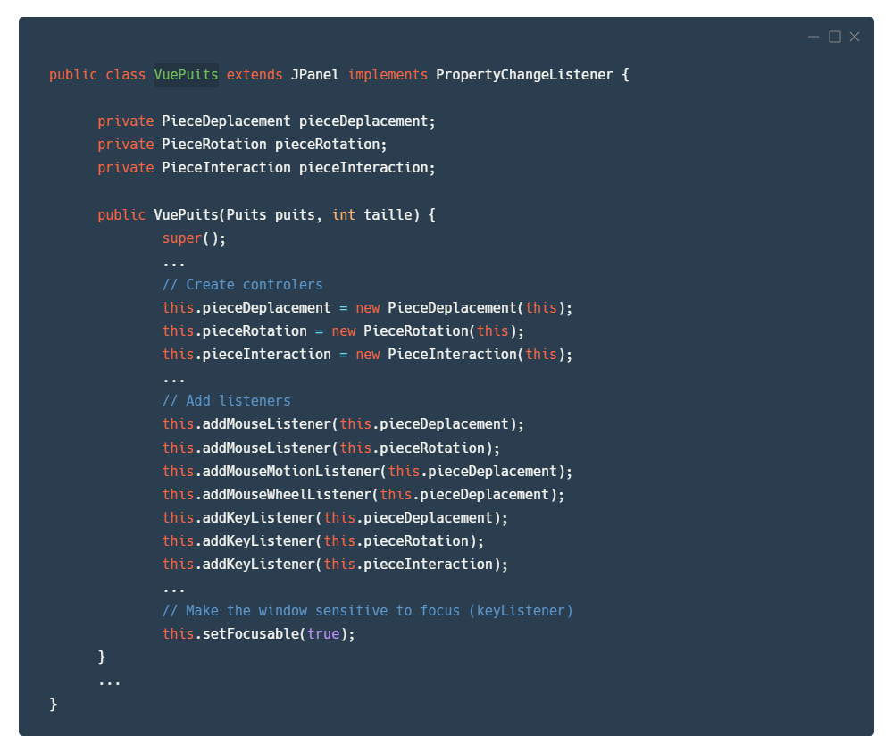
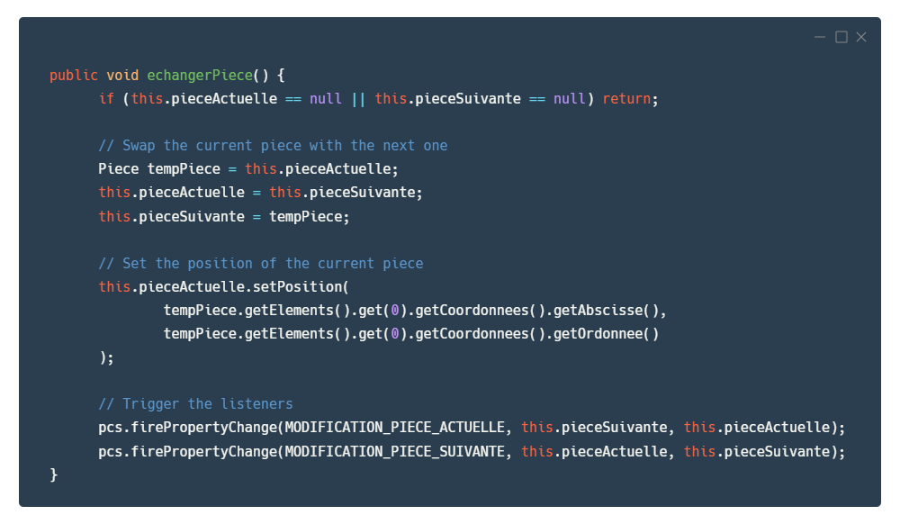
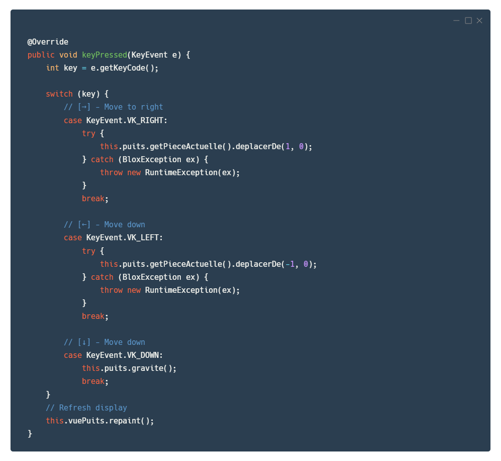
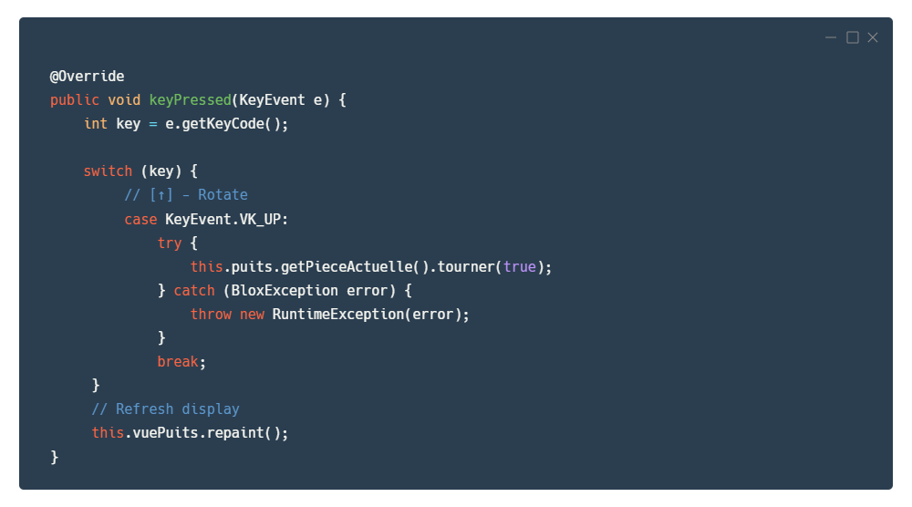
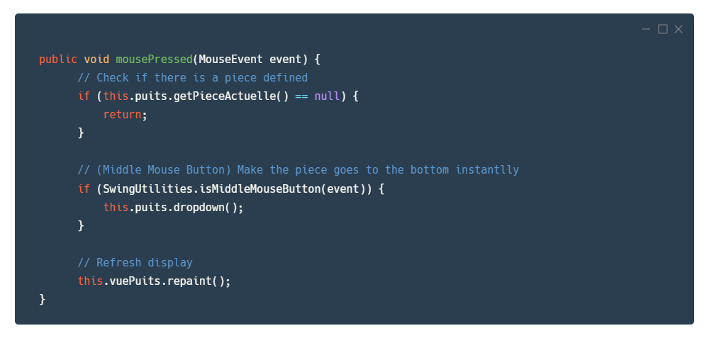
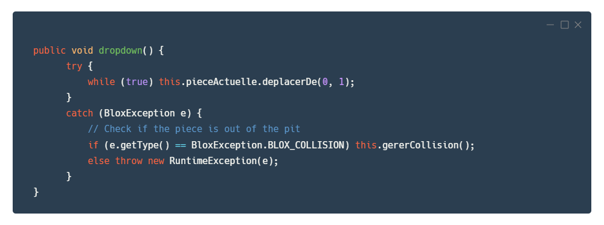

# EXTENSIONS

## Table des matières

  - [Table des matières](#table-des-matières)
  - [🧩 Échange de pièce](#-échange-de-pièce)
  - [🎹 Déplacements clavier](#-déplacements-clavier)
  - [🌠 Descente rapide](#-descente-rapide)
  - [💎 Score](#-score)
  - [🪂 Gravité accélérée](#-gravité-accélérée)

## 🧩 Échange de pièce

`Description` : Lorsque le joueur appuie sur une touche, la pièce actuelle et la pièce suivante sont échangées.

`Réalisation` :

Création d'une classe `PieceInteraction` qui étend de l'interface `KeyListener`. J'aurais pu utiliser la faire hériter de KeyAdapter, mais les classes `PieceDeplacement` et `PieceRotation` héritent déjà d'une classe mère. Cela aurait réduit mes possibilités par la suite.

Dans la classe `VuePuits`, je créé une instance de `PieceInteraction` et je l'ajoute à la liste des observateurs du puits. Cela permettra de transmettre les événements (clavier) aux différents contrôleurs.

J'ai ensuite implémenté les méthodes `keyPressed`, `keyReleased` et `keyTyped` de l'interface.
Dans `keyPressed`, je récupère le code la touche appuyée, puis je test si c'est un `R`. Dans ce cas, j'appelle la méthode `echangerPiece` du puits.

Cette méthode permet d'échanger la pièce actuelle et la pièce suivante si elles existent.
À la fin de la méthode, je notifie les observateurs du puits que les pièces ont été changées.

## 🎹 Déplacements clavier

`Description` : Permettre au joueur de déplacer la pièce avec les flèches du clavier.

`Réalisation` :

J'ai étendu les classes `PieceDeplacement` et `PieceRotation` avec l'interface `KeyListener`, comme pour l'extension précédente. J'ai implémenté les méthodes `keyPressed`, `keyReleased` et `keyTyped` de l'interface.

Dans `keyPressed`, je récupère le code la touche appuyée, puis je test les quatre possibilités. Dans le cas d'une flèche droite ou gacuhe, je déplace la pièce avec la méthode `deplacerDe`. Pour la flèche du bas, j'appelle la méthode `gravite` du puits afin de faire descendre la pièce. Enfin, pour la flèche du haut, j'appelle la méthode `tourner` de la pièce actuelle.

J'appelle ensuite la méthode `repaint` du puits pour mettre à jour l'affichage.

Les fonctions relatives aux déplacements de la pièce sont dans la classe `PieceDeplacement`. Tandis que la gestion de la rotation est dans la classe `PieceRotation`.

## 🌠 Descente rapide

`Description` : Permettre au joueur de faire tomber sa pièce instantanément au fond du puits en cliquant sur sa molette de souris.

`Réalisation` :

J'ai utilisé la méthode `mousePressed` de la classe mère `MouseAdapter`, dans `PieceDeplacement`. Cette méthode est déclenchée lorsque l'utilisateur appuie sur un bouton de la souris.

J'ai donc testé si la touche correspondait à la molette de la souris, puis j'ai appelé la méthode `dropdown` du puits.

J'ai créee la méthode `dropdown` dans la classe `Puits`. Cette méthode permet de faire descendre la pièce actuelle jusqu'à ce qu'elle touche le fond du puits ou une autre pièce.

## 💎 Score

`Description` : Afficher le score du joueur en fonction du nombre de lignes qu'il a fait disparaître.

`Réalisation` :

J'ai tout d'abord créé une class `Score`. Cette classe possède un attribut `score` qui est incrémenté à chaque fois que le joueur fait disparaître une ligne. J'ai également créé une méthode `getScore` qui permet de récupérer le score actuel.

Pour afficher ce score, j'ai créé un classe `VueScore`.

`afficherScore` est appelé dans la méthode `paintComponent` de `PanneauInformation`.

## 🪂 Gravité accélérée

`Description` : Augmenter progressivement la vitesse de descente des pièces.

`Réalisation` :

J'ai implémenté une gestion de la vitesse en fonction su score, dans la class `Score`. La classe reçoit maintenant en paramètre une instance de `Gravite`. Cet objet voit la durée de son timer diminuer en fonction du score.

